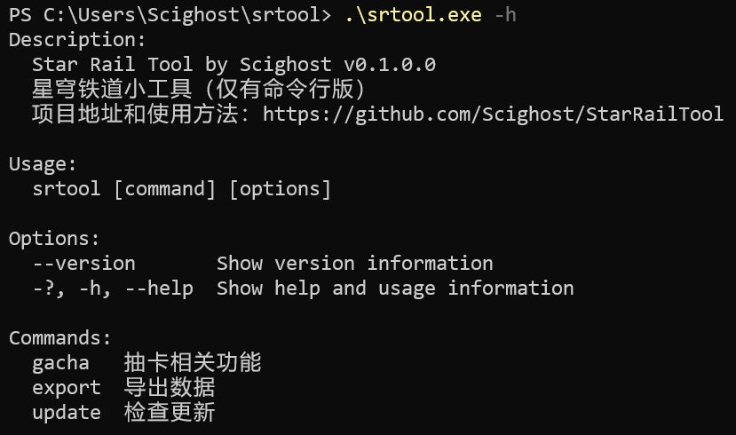
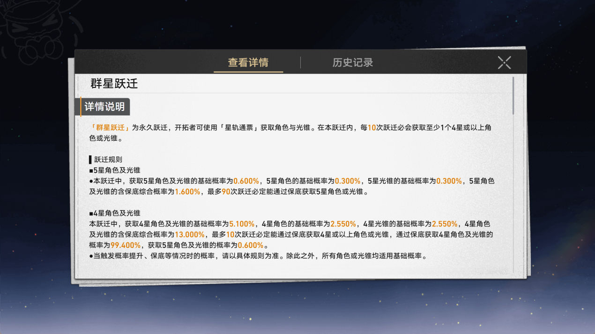

# 星穹铁道小工具（仅有命令行版）


## 功能 ~~画饼~~

- [x] 抽卡记录
- [ ] 开拓月历
- [ ] 忘却之庭

## 使用方法

在 [Releases](https://github.com/Scighost/StarRailTool/releases) 下载并解压后，进入到含有 `srtool.exe` 的文件夹，在空白处使用右键菜单打开**终端**，输入 `.\srtool.exe -h` 并按下回车。这是你应该看到类似下图这样的结果，同时文件夹中多出了两个文件 `Config.json` 和 `Database.db`。

<details>
<summary>终端</summary>



</details>


### 抽卡记录

首先明确一个概率，游戏中的这个界面其实是一个网页，我把它称作**抽卡记录页面**，这个页面的网址链接会被缓存在 `StarRail_Data\webCaches\Cache\Cache_Data\data_2` 这个文件中，我把这个链接称作**抽卡记录网址**。

<details>
<summary>抽卡记录页面</summary>



</details>


#### 获取抽卡记录

打开抽卡记录页面后，在终端中输入下面这个，会从游戏缓存文件中自动找到最新的抽卡记录网址，国际服需要加上参数 `-server os`

```
.\srtool.exe gacha get
.\srtool.exe gacha get -server os
```

获取抽卡记录结束后，记录和网址都会保存在本地数据库中，如果要使用已保存的网址获取记录，需要加上参数 `-uid`，网址的有效期大约是一天

```
.\srtool.exe gacha get -uid 123456789
```

程序默认只会获取最新的抽卡记录，如果想要获取账号内的所有记录，需要加上参数 `-all`

```
.\srtool.exe gacha get -all
.\srtool.exe gacha get -uid 123456789 -all
```

抽卡记录的语言和游戏内设置的语言一样，使用参数 `-lang` 可以设置特定的语言

```
.\srtool.exe gacha get -lang zh-cn
.\srtool.exe gacha get -lang en-us
```

#### 简单统计

输入以下命令，显示数据库中所有的账号，括号内是上一次五星和四星后的抽数

```
.\srtool.exe gacha stats
```

| Uid       | 总数 | 群星跃迁 | 始发跃迁  | 角色跃迁 | 光锥跃迁 | 上次更新时间        |
| --------- | ---- | -------- | -------- | -------- | -------- | ------------------- |
| 101566062 | 41   | 1 (1-0)  | 40 (40-3) | 0 (0-0)  | 0 (0-0)  | 2023-04-28 23:52:23 |


单独统计一个账号的记录

```
.\srtool.exe gacha stats 123456789
```

| 跃迁类型 | 数量      | 5星     | 4星          |
| ------- | --------- | ------- | ------------ |
| 群星跃迁 | 1 (1-0)   | 0 (NaN) | 1 (100.000%) |
| 始发跃迁 | 40 (40-3) | 0 (NaN) | 4 (10.811%)  |

#### 列举记录

根据条件列举某一账号的抽卡记录

```
列举大于等于4星的记录
.\srtool.exe gacha list 123456789

列举群星跃迁中大于等于5星的记录
.\srtool.exe gacha list 123456789 -type 1 -rank 5

列举角色跃迁中大于等于4星的记录，按时间降序排列
.\srtool.exe gacha list 123456789 -type 11 -rank 4 -desc
```

#### 导出记录

支持导出到 excel 和 json 文件

```
把 123456789 的数据以 excel 的格式导出到 gacha_export.xlsx 文件中
.\srtool.exe gacha export 123456789 -output gacha_export.xlsx

把所有账号的数据以 json 的格式导出到 all_uid 文件夹中
.\srtool.exe gacha export -all -output .\all_uid\ -format json
```

### 配置文件

程序运行一次后，会在文件夹内生成一个配置文件 `Config.json`，下表是文件内各字段的含义。

| Key | Value | Comment |
| --- | --- | --- |
| InstallPath_CN | string | 国服游戏本体文件夹 |
| InstallPath_OS | string | 国际服游戏本体文件夹 |
| EnableAutoBackupDatabase | bool | 开启自动备份数据库 |
| BackupIntervalInDays | int | 自动备份数据库间隔天数 |
| AutoCheckUpdate | bool | 自动检查更新 |

## 一些吐槽

崩铁和原神的 Api 简直就是一个模子刻出来的，但是前者提供的信息要比后者完整的多。就拿抽卡记录举个例子：


``` json
// 崩铁
{
    "page": "8",
    "size": "5",
    "region": "prod_gf_cn",
    "region_time_zone": 8, // 时区
    "list": [
        {
            "uid": "123456789",
            "gacha_id": "4001", // 卡池 id
            "gacha_type": "2",
            "item_id": "20001", // 物品 id
            "count": "1",
            "time": "2023-04-26 11:26:40",
            "name": "物穰",
            "lang": "zh-cn",
            "item_type": "光锥",
            "rank_type": "3",
            "id": "1682478600023251362"
        }
    ]
}

// 原神
{
    "page": "1",
    "size": "5",
    "total": "0", // 无用
    "region": "cn_gf01",
    "list": [
        {
            "uid": "123456789",
            "gacha_type": "301",
            "item_id": "", // 无用
            "count": "1",
            "time": "2023-04-20 16:12:22",
            "name": "黑缨枪",
            "lang": "zh-cn",
            "item_type": "武器",
            "rank_type": "3",
            "id": "1681977960000167244"
        }
    ]
}
```

真就是 **我知道有问题，但是我会在下个游戏中优化**
